# generateIssueWf


# Table of Content

- [generateIssueWf](#generateissuewf)
- [Table of Content](#table-of-content)
- [Introduction](#introduction)
- [System OverView](#system-overview)
- [Overview of Milestones](#overview-of-milestones)
- [Overview of Projects](#overview-of-projects)
- [Dependencies](#dependencies)
- [Where this script fixes](#where-this-script-fixes)
  - [Workflow Dispatch](#workflow-dispatch)
  - [Issue's Title](#issues-title)
  - [Issue's Label](#issues-label)
  - [Issue's Template](#issues-template)
  - [Issue's Project](#issues-project)
  - [Issue's Column](#issues-column)
  - [Issue's Milestone](#issues-milestone)
- [Files generated by `generateWfFroIssues.yml`](#files-generated-by-generatewffroissuesyml)
- [What is files generated by `generateWfFroIssues.yml`](#what-is-files-generated-by-generatewffroissuesyml)
- [Files manipulated by `removeWfForIssuesAndCsvContent.yml`](#files-manipulated-by-removewfforissuesandcsvcontentyml)

# Introduction

This script generates workflow files to make issue.

- `generateWfFroIssues.yml` makes workflow files based on `generateIssues.yml`.
- Workflow files generated by `generateWfFroIssues.yml` makes issues and generate cards to `Todo` column in the `Todo` project.
- `removeWfForIssuesAndCsvContent.yml` remove files and delete contents in files.(e.g. workflow files, csv files, text memo about workflow files)

# System OverView

```mermaid
sequenceDiagram
    autonumber
    actor USER as User
    actor SGA as Schedule<br>of GitHub Acitons
    participant GWFI as generateWfForIssues.yml
    participant GWMIP as generateIssueWf<br>/generate_workflow_to_make_issue.py
    participant GIY as generateIssues.yml
    participant RWFICC as removeWfForIssuesAndCsvContent.yml
    participant RWMIP as generateIssueWf<br>/remove_workflow_files_making_issue.py
    participant CSVS as generateIssueWf<br>/*.csv
    participant GIA as generateIssues_*.yml
    participant GWFT as generatedWfFiles.txt
    participant GI as GitHub Issues
    participant GP as GitHub Projects
    links GWFI: {"Source": "https://github.com/landmaster135/neptunus-note/tree/master/.github/workflows"}
    links GWMIP: {"Source": "https://github.com/landmaster135/neptunus-note/tree/master/generateIssueWf"}
    links GI: {"Source": "https://github.com/landmaster135/neptunus-note/tree/master/.github/workflows"}
    links CSVS: {"Source": "https://github.com/landmaster135/neptunus-note/tree/master/generateIssueWf"}
    links GIA: {"Source": "https://github.com/landmaster135/neptunus-note/tree/master/.github/workflows"}
    links GWFT: {"Source": "https://github.com/landmaster135/neptunus-note/tree/master/.github/workflows"}
    links RWFICC: {"Source": "https://github.com/landmaster135/neptunus-note/tree/master/.github/workflows"}
    links RWMIP: {"Source": "https://github.com/landmaster135/neptunus-note/tree/master/generateIssueWf"}
    USER->>CSVS: Edit titles wanted to be added to Issues and Projects.
    Note over USER, GP: Execution at midnight starts
    rect rgb(20, 90, 90)
        SGA->>GWFI: Exe by cron
        GWFI->>GWMIP: Exe
        GWMIP-->>CSVS: Refer
        CSVS-->>GWMIP: Return
        GWMIP->>RWFICC: Rewrite cron
        GWMIP-->>GIY: Refer
        GIY-->>GWMIP: Return
        GWMIP->>GIA: Generate
        GWMIP->>GWFT: Additionally write
        Note right of GWMIP: End of Python Script
        Note right of GWFI: End of Action
    end
    par Make Issues and add cards to Projects
        SGA->>GIA: Exe by cron
        GIA->>GI: Make Issues
        GIA->>GP: Add cards to Projects
        Note right of GIA: End of Action
    end
    rect rgb(90, 20, 90)
        SGA->>RWFICC: Exe by cron
        RWFICC->>RWMIP: Exe
        RWMIP->>GIA: Remove files of actions
        RWMIP->>GWFT: Delete name list of actions
        RWMIP->>CSVS: Delete title list of issues
        Note right of RWMIP: End of Python Script
        Note right of RWFICC: End of Action
    end
    Note over USER, GP: Execution at midnight terminates
```



# Overview of Milestones

| Id | Title |
|---:|:---:|
| 1 | Salesforceの資格勉強 |
| 2 | TestGAS開発 |
| 3 | Salesforce：Trailhead実績 |
| 4 | Microsoft Learning実績 |
| 5 | マンガ：プログラミングのバグあるあるシリーズ |
| 6 | 何かに使えそうな資格取得リスト |

# Overview of Projects

| Id | Title |
|---:|:---:|
| 1 | Todo |
| 2 | Todo2 |

# Dependencies

[./requirements.txt](./requirements.txt)

# Where this script fixes

is 7 places.

## Workflow Dispatch

```python
  workflow_dispatch:
```

## Issue's Title

```python
        title: _(txtのタイトルが入る)
```

## Issue's Label

```python
        labels: "book"
```

## Issue's Template

```python
        template: ".github/ISSUE_TEMPLATE/custom.md"
```

## Issue's Project

```python
        project: 1
```

## Issue's Column

```python
        column: Todo
```

## Issue's Milestone

```python
        milestone: 1
```

# Files generated by `generateWfFroIssues.yml`

They are generated based on `generateIssues.yml`.

For example...

- ./github/workflows/generateIssues_blog_00.yml
- ./github/workflows/generateIssues_book_01.yml
- ./github/workflows/generatedWfFiles.txt

# What is files generated by `generateWfFroIssues.yml`

Make issues and generate cards to `Todo` column in the `Todo` project.

# Files manipulated by `removeWfForIssuesAndCsvContent.yml`

Being removed example...

- ./github/workflows/generateIssues_blog_00.yml
- ./github/workflows/generateIssues_book_01.yml

Being deleted example...

- ./github/workflows/generatedWfFiles.txt
- ./books.csv
- ./blogs.csv


return [top](#generateissuewf)
